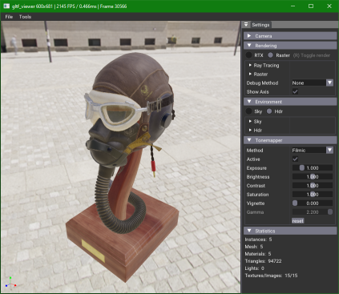
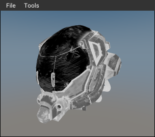
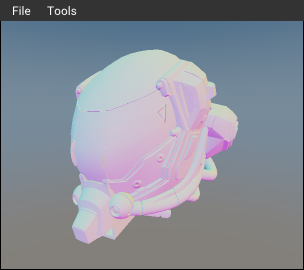
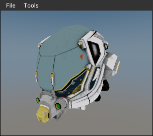
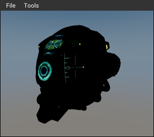
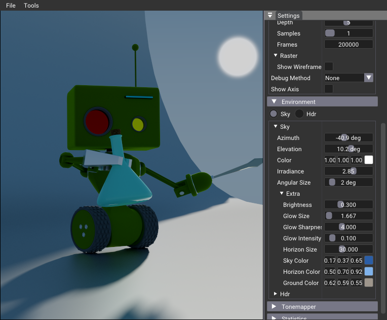
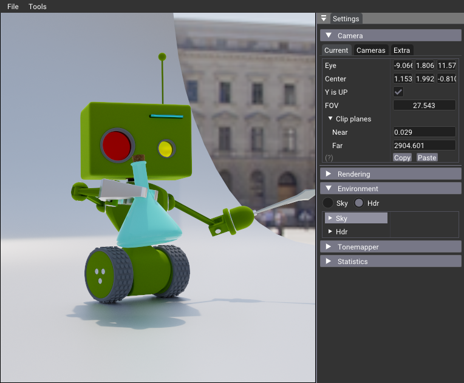
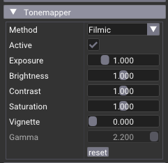
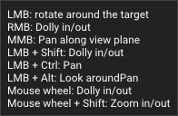
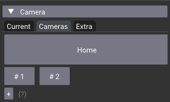

# Vulkan glTF Scene Raytrace/Raster

|RTX | Raster|
|:------------: | :------------: |
| ||

This sample loads [glTF](https://www.khronos.org/gltf/) (.gltf/.glb) scenes and will ray trace or rasterize it using glTF 2.0 material and textures. It can display an HDR image in the background and be lit by that HDR or use a built-in Sun&Sky. It renders in multiple passes, background, scene, and then tone maps the result. It shows how multiple resources (geometry, materials and textures) can be shared between the two rendering systems. 

## RTX

Implements a path tracer with global illumination. 

The options are:
* Depth : number of bounces the path can do
* Samples: how many samples per pixel at each frame iteration
* Frames: the maximum number of frame iteration until the application idles

## Raster

The rasterizer uses the same Vulkan resources as the path tracer; scene geometry, scene data, textures. And for shading, it shares many of the same functions.

The only option for raster, is to display wireframe on top.

## Debug

There is also the ability to debug various out channels, such as:

|metallic|roughness|normal|base|emissive|
|---|---|---|---|---|
||||||

## Environment

It is possible to modify the environment, either by choosing an integrated sun and sky, or by lighting the scene using Image Base Lighting. In the latter case, you need an image (.hdr). You can find examples of such images at the following address [Poly Haven](https://polyhaven.com/hdris)

| Sun & Sky | HDRi |
| --- | --- |
| ||

Having HDRi (High Dynamic Range Imaging) to illuminate the scene greatly simplifies complex lighting environments. It also helps to integrate 3D objects into its environment.

This example loads HDR images, then creates an importance sampling acceleration structure used by the ray tracer and stores the [PDF](https://en.wikipedia.org/wiki/Probability_density_function) in the alpha channel of the RGBA32F image.

For real-time rendering, we use the created acceleration structure and create two cubemaps. One containing the diffuse irradiance and the other, storing the glossy reflection, where the different levels of glossiness are stored in separate mipmap levels.

## Tonemapper

We could not get good results without a tone mapper. This is done with a compute shader and different settings can be made.

## Camera

The camera navigation follows the [Softimage](https://en.wikipedia.org/wiki/Softimage_(company)) default behavior. This means, the camera is always looking at a point of interest and orbit around it.

Here are the default navigations:

The camera information can be fine tune by editing its values.

Note: **copy** will copy in text the camera in the clipboard, and pressing the **paste** button will parse the clipboard to set the camera. 

Ex: `{0.47115, 0.32620, 0.52345}, {-0.02504, -0.12452, 0.03690}, {0.00000, 1.00000, 0.00000}`

### Save and Restore Cameras

It is also possible to save and restore multiple cameras in the second tab. Press the `+` button to save a camera, the middle button to delete it. By pressing one of the saved cameras, its position, interests, orientation and FOV will be changed smoothly. 

### Other modes 

Other navigation modes also exist, like fly, where the `w`, `a`, `s`, `d` keys also moves the camera. 

----
## Schema of the Program

The `main()` is adding all the extensions which is needed for this application and where the `Raytracing` class is created. 

### onAttach()
In `onAttach()` we are creating many helpers, such as

* **nvvk::DebugUtil** : utility for setting debug information visible in Nsight Graphics
* **AllocVma** : the allocator of resources based on VMA, for images, buffers, BLAS/TLAS
* **Scene** : the glTF scene, loaded with tiny_gltf and data adjusted for our needs.
* **SceneVk** : the Vulkan version of Scene, basically vertices and indices in buffers, textures uploaded.
* **SceneRtx** : the version of Scene for ray tracing, BLAS/TLAS using information from SceneVk
* **TonemapperPostProcess** : a tone mapper post-process
* **nvvk::SBTWrapper** : an helper to create the Shading Binding Table
* **SkyPass** : creates a synthetic sky, for both raster and ray tracing.
* **nvvk::RayPickerKHR** : tool that sends a ray and return hit information.
* **nvvk::AxisVK** : show a 3D axis in the bottom left corner of the screen
* **HdrEnv** : loads HDR and pre compute the importance acceleration structure sampling information.
* **HdrEnvDome** : pre-convolute the diffuse and specular contribution for raster HDR lighting.

### onDetach()

Will destroy all allocated resources

### onUIMenu()

Will be modifying what we see in the the window title. It will also create the menu, like `File`, `Help` and deal with some key combinations.

### onFileDrop()

Will receive the path of the file been dropped on. If it is a .gltf, .glb or .hdr, it will load that file. 

### onUIRender()

This is where the GUI rendering is located, the parameters that can be changed. This is also where we display the rendered image. The rendered image is a component of the user interface that covers the Viewport window. 

### onRender()

Called with the frame command buffer, sets the information used by shaders in some buffers, then calls either `raytraceScene(cmd)` or `rasterScene(cmd)`.

Tone mapper is applied to the rendered image, and axis draw on top of the final image.

----

